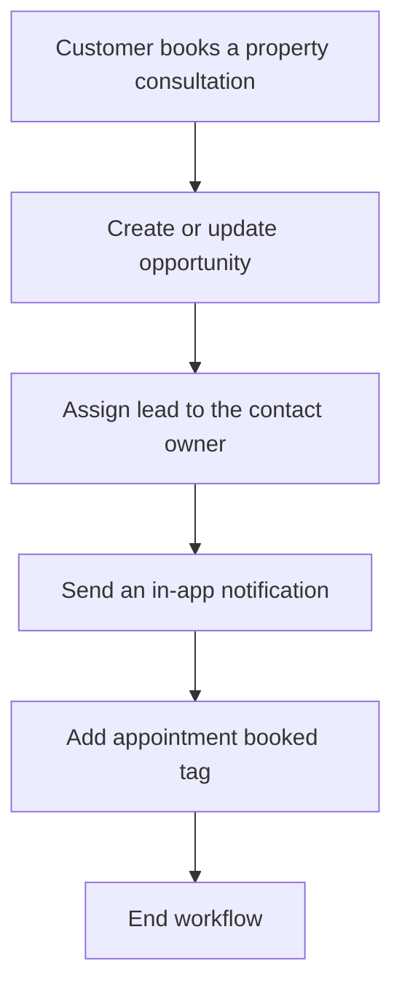

# Real Estate Lead-to-Appointment Automation

A production-ready GoHighLevel (GHL) workflow that turns a booked property consultation into a structured sales opportunity, assigns the lead, alerts the owner, and labels the contact for follow-up.

## What it solves

Manual lead handling creates slow response times, missed appointments, and inconsistent CRM records. This workflow standardizes everything that should happen immediately after a prospect books a consultation.

## Automation flow

## Features

- Calendar-specific appointment trigger
- Automatic opportunity creation or update
- Placement in the `Appointment Booked` pipeline stage
- Automatic lead ownership assignment
- Internal notification linked to the contact record
- Contact tagging for segmentation and follow-up
- Safe duplicate handling through create-or-update logic
- Tested end-to-end before publication

## Verified result

The workflow was tested with a dummy CRM contact. Every production action completed successfully:

| Step | Result |
|---|---|
| Add contact to workflow | Passed |
| Create or update opportunity | Passed |
| Assign lead owner | Passed |
| Send internal notification | Passed |
| Add appointment tag | Passed |
| Finish workflow | Passed |

See [the full test report](docs/test-report.md) for the validation notes.

## Repository contents

- [`workflow-spec.json`](workflow-spec.json) - anonymized, platform-neutral workflow blueprint
- [`docs/setup-guide.md`](docs/setup-guide.md) - implementation instructions
- [`docs/test-report.md`](docs/test-report.md) - end-to-end test evidence and correction log

## Privacy and security

This repository intentionally excludes location IDs, workflow IDs, access tokens, contact information, and other private CRM data. Replace every placeholder with values from your own GHL sub-account.

## Skills demonstrated

CRM automation, workflow design, pipeline management, lead routing, internal notifications, debugging, end-to-end testing, and privacy-safe technical documentation.

